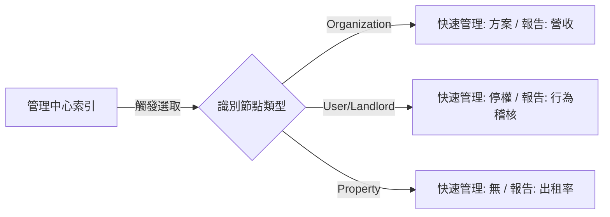

# 🛰️ AIC 統合治理中心：設計架構 (Management Architecture)

本文件定義了「管理中心」的核心設計架構，旨在實現全平台資產的一站式治理與診斷。

## 1. 核心交互邏輯：Context-Aware Command
系統採用 **「選取即感知 (Select-to-Sense)」** 機制。當管理員在左側「管理中心索引 (Nexus Index)」選取不同層級的實體時，系統會自動切換右側工作區的操作權限與數據維度。

### 交互範例 (情境化功能切換)
| 選取對象 (Node Type) | 動態按鈕 1：快速管理 | 動態按鈕 2：數據報告 |
| :--- | :--- | :--- |
| **🏢 組織 (Organization)** | 變更訂閱方案 / 調整配額 | 開啟該組織之營收與資產日誌 |
| **👤 房東 (Landlord)** | 帳號停權 / 身份稽核 | (不顯示，導流至所屬組織) |
| **🏠 房源 (Property)** | (不顯示，導流至組織管理) | 進入房源診斷、租金趨勢與出租紀錄 |
| **🛠️ 管理員 (Manager)** | 權限收回 / 職務轉移 | (不顯示) |

## 2. 治理安全機制：影響預估 (Impact Advisor)
基於 `roles.md` 的停權政策，系統在執行任何破壞性操作前，會即時顯示「影響鏈結反應」。

*   **案例：停權房東 (Landlord)**
    *   *系統自動計算並提示：* 「此行為將同時導致旗下 5 間房源隱藏，並將 2 名代管人員變更為唯讀模式。」

## 3. 視覺語言：Nexus Pulse
*   **動態脈動點 (Pulse Indicator)：** 每個實體左側的小燈號，反映實體即時狀態。
    *   🟢 **綠色 (Glow)：** 已出租/活動中。
    *   🔵 **藍色 (Solid)：** 閒置中。
    *   ⚪ **灰色 (Muted)：** 已停權。
*   **DNA 診斷圖表：** 展示實體的健康狀況（如資源配額、掃描進度、系統延遲）。

## 4. 深度診斷與改善方向 (2026-04-11 稽核)

### 4.1 快速管理功能缺失 (QuickAction Gap)
*   **現狀**：房源 (Property) 節點點擊後無專屬管理操作，Drawer 內容呈現真空。
*   **改善**：應實作 Property Action 區塊，支援「一鍵變更維修狀態」與「快速指派 Manager」。

### 4.2 路由循環 Bug (Data Report Loop)
*   **現狀**：由於目標路由 (`/admin/properties`, `/admin/organizations`) 尚未定義，導致數據報告按鈕無效。
*   **改善**：將按鈕暫時導向內部選取狀態，或實作專屬分析視圖。

### 4.3 資料權限架構 (Security Analysis)
*   **架構**：API 驅動之角色樹狀過濾 (Role-based Pruning)。
*   **安全性**：良好。資料在伺服器端已完成物理隔離，防止越權讀取。
*   **效能**：待優化。Admin 的全量遞迴查詢在大型數據集下可能產生延遲。

## 5. 目標架構圖 (UML)

## 5. 設計參考文獻
*   全域規格：[`spec.md`](../spec.md)
*   角色停權影響矩陣：[`docs/roles.md`](roles.md#4-停權行為與影響矩陣-suspension-policy)