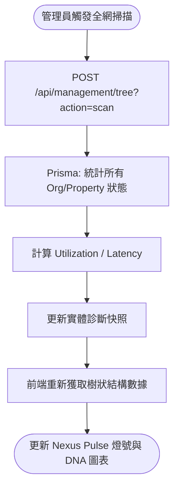
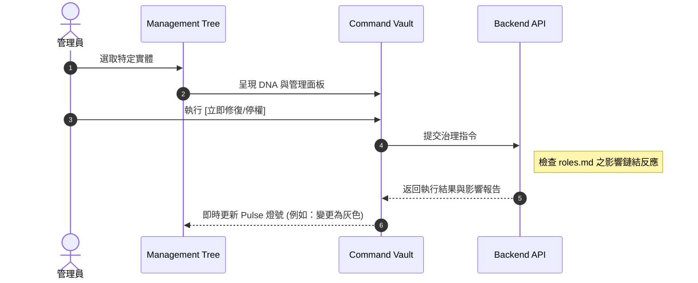
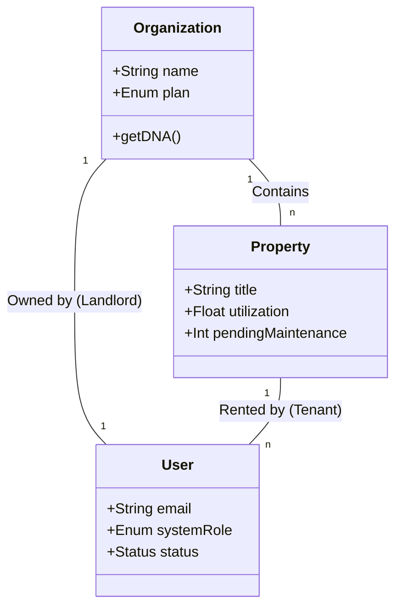

# 🛰️ AIC 統合治理中心：綜合技術規格文件 (Comprehensive Specification)

## 1. 系統願景與核心價值
將分散的組織管理、人員稽核與資產診斷功能，整合為全域資產中樞 (`/admin/management`)。透過「Nexus Pulse」設計語言與「Diagnostic DNA」診斷模型，實現資產健康狀況的即時感知與自動化治理建議。

## 2. 核心架構：Nexus Nexus
系統採用 **「選取即感知 (Select-to-Sense)」** 機製與 **「極致扁平化」** 的導航設計。

### 2.1 交互邏輯 (Context-Aware Command)
當管理員在左側「管理中心索引 (Nexus Index)」選取不同層級的實體時，系統會自動切換右側工作區的操作權限與數據維度。

| 選取對象 (Node Type) | DNA 診斷維度 | 快速管理 (Quick Action) |
| :--- | :--- | :--- |
| **🏢 組織 (Organization)** | 下屬房源總利用率、維修積壓總計 | 變更訂閱方案 / 調整配額 |
| **👤 房東 (Landlord)** | 個人資產回報與健康度 | 帳號停權 / 身份稽核 |
| **🏠 房源 (Property)** | 精確利用率、當前維修負擔 | 維修狀態變更 / 指派管理員 |

## 3. 診斷系統：Diagnostic DNA
這是管理中心的核心技術，用於將冷冰冰的數據轉化為可視化的健康指標。

### 3.1 核心指標定義
*   **資源利用率 (Utilization)**: 基於 `Property` 與 `Contract` (狀態為有效或 Occupied) 計算出的實體飽和度。
*   **系統延遲 (Latency)**: 基於 `Maintenance` (狀態為 Pending 或 In Progress) 的數量與停留時間。
*   **歷史脈動 (Pulse History)**: 實體過去 7 次診斷的數據波形 (Sparkline)，用於預測趨勢。

### 3.2 AI 診斷洞察 (AI Insights)
系統根據診斷數值自動生成繁體中文的專業洞察：
- **健康 (利用率 > 80% 且 延遲 < 15%)**: 「系統運作極為高效，資源配置處於最佳狀態。」
- **高負載 (延遲 > 30%)**: 「偵測到報修積壓嚴重。建議立即增加維護人力或優化修復流程。」
- **低效率 (利用率 < 50%)**: 「資產閒置率過高。建議檢視定價策略或進行市場推廣。」

## 4. 業務流程與數據流

### 4.1 全網掃描流程 (Global Scan)

### 4.2 停權治理操作 (Suspension Policy)

## 5. 物件關聯與血緣感知 (Asset Lineage)

## 6. 技術實作詳細 (實現環節)

### 6.1 後端 API (`/api/management/tree/route.ts`)
- 實作了深度遞迴聚合邏輯。
- 支持 `?id=` 參數之精確節點刷新。

### 6.2 前端組件 (`ManagementViewWrapper.tsx`)
- 使用 `Framer Motion` 實作 DNA 圖表的進度條動畫。
- 整合 `lucide-react` 提供直觀的 Pulse 狀態指示器。

## 7. 未來擴展 (Roadmap)
- [ ] **與 `/admin/financial` 整合**: 在 DNA 中加入營收波動維度。
- [ ] **自動化預警**: 當利用率低於臨界值時，自動發送 AI 生成的建議文案給房東。
- [ ] **多租戶隔離優化**: 進一步加固 Admin 操作的物理路徑追蹤。