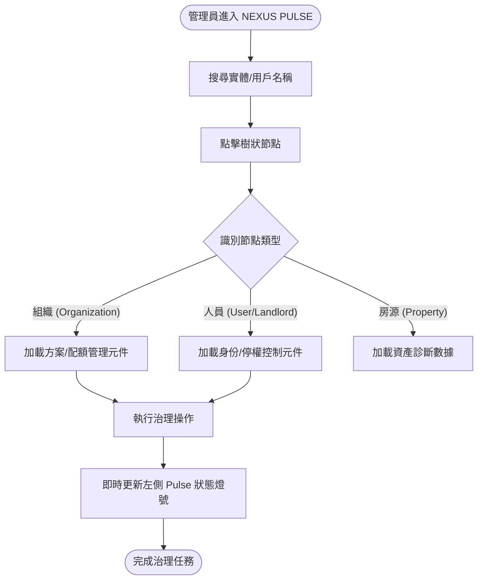
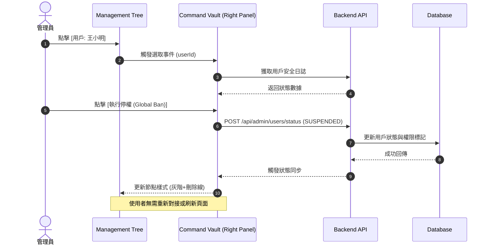
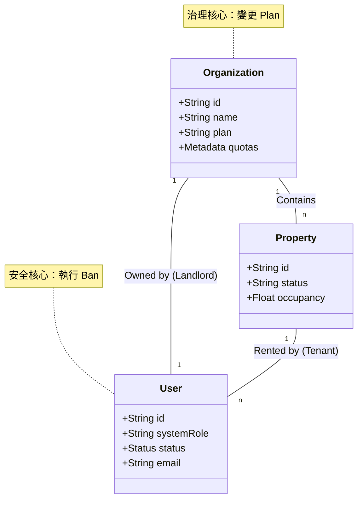

# 🛰️ AIC 統合治理中心設計規範 (v1)

## 1. 系統願景
將獨立的組織 (`/admin/organizations`) 與用戶 (`/admin/users`) 管理功能整合進全域資產中樞 (`/admin/management`)，打造單一入口的「一站式治理解析終端」。

## 2. 業務流程圖 (Flowchart)

## 3. 循序圖 (Sequence Diagram) - 停權操作範例

## 4. 物件關聯圖 (ERD / Asset Lineage)

## 5. UI 規範：Command Vault 狀態切換
- **Empty State**: 顯示 "Strategic Nexus Gateway" 指引介面。
- **Org Mode**: 面板頂部顯示 `Building2` 圖示，整合原 `OrgPlanManager` 組件。
- **User Mode**: 面板頂部顯示 `ShieldAlert` 圖示，整合原 `UserStatusToggle` 組件。
- **Zero-Scroll**: 確保面板內容在手機與桌機版皆不產生全域滾動條。