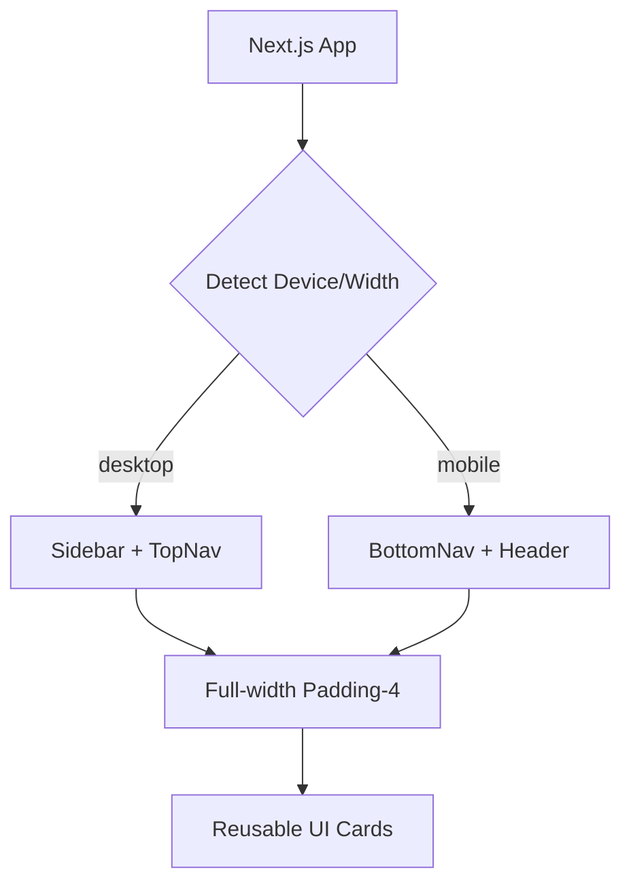

# 🎨 PrimeStay UI/UX 高規格設計規範 (ui_design_spec.md)

## 1. 設計願景與目標
本文件旨在為 PrimeStay 平台提供一套「高端、專業、直覺」的視覺與交互規範。
- **目標用戶**: 房東、物業管理員、高端房客。
- **核心價值**: 信任感、效率、跨設備無縫銜接。
- **優先順序**: 行動端體驗優先 (Mobile First) > 數據視覺化 > 簡約美學。

## 2. 視覺風格指南 (Visual Style Guide)

### 2.1 配色方案 (Color Palette)
建議使用冷靜且具備質感的黑色與深藍色系，搭配金色或土耳其藍作為點綴色。
- **Primary**: `#0F172A` (Slate 900) - 導航與主要背景。
- **Secondary**: `#3B82F6` (Blue 500) - 主要動作、連結、選中狀態。
- **Accent**: `#F59E0B` (Amber 500) - 重要提醒、金錢、高品質象徵。
- **Background**: `#F8FAFC` (Slate 50) - 通用底色。
- **Success**: `#10B981` (Emerald 500) - 已繳費、已維修。
- **Danger**: `#EF4444` (Red 500) - 逾期、報修中。

### 2.2 字體規範 (Typography)
- **繁體中文**: `Inter`, `Noto Sans TC`, system-ui.
- **標題**: `font-bold`, `tracking-tight`, 使用 Inter 提升現代感。
- **內文**: `text-slate-600`, 優化行高 (`leading-relaxed`) 以提升閱讀性能。

### 2.3 陰影與圓角 (Elevation & Border Radius)
- **圓角**: 大量使用 `rounded-xl` (12px) 或 `rounded-2xl` (16px) 以呈現現代軟性風格。
- **陰影**: 使用 `shadow-sm` 於平時，`hover:shadow-md` 於交互時。避免濃重黑影。

---

## 3. 佈局策略 (Layout Strategy)

### 3.1 PC 端 (Desktop Layout) - 管理高效化
- **側邊收納導航 (Collapsible Sidebar)**:
  - 提供完整功能的文字標籤。
  - 頂部包含組織切換器 (Organization Switcher)。
- **頂部工具列 (Top Navigation)**:
  - 麵包屑導航 (Breadcrumbs)。
  - 全域搜索 (Cmd+K)。
  - 通知中心 (Notifications) 與用戶選單。
- **內容區**: 寬度限制在 `max-w-7xl`，採用多欄式佈局。

### 3.2 手機端 (Mobile Layout) - 觸控便利化
- **底部導航列 (Bottom Navigation)**:
  - 核心 4-5 個功能點：首頁、房源/租約、帳單、設定。
- **抽屜操作 (Bottom Drawers)**:
  - 所有的「新增」、「編輯」操作皆從底部彈出抽屜，方便大拇指操作。
- **卡片堆疊 (Stacked Cards)**:
  - 將表格轉換為資訊卡片。

---

## 4. 核心頁面設計規範

### 4.1 房東儀表板 (Landlord Dashboard)
- **視覺化數據**:
  - 顶部 4 個快訊卡片 (總營收、空房數、待處理報修、逾期帳單)。
  - 中間區塊：本月營收趨勢圖 (Line Chart)。
- **待辦任務清單**: 顯示「急需處理」項目。

### 4.2 房客行動端中心 (Tenant Mobile Hub) - 深度設計
房客端介面採取完全的行動優先設計，模擬原生 App 的流暢感。

#### 4.2.1 首頁 (Dashboard) 視覺階層
- **動態狀態條 (Status Bar)**: 顯示目前租約狀態 (例如：`✅ 租約進行中` 或 `⚠️ 帳單待繳`)。
- **核心指標卡片 (Core Hero)**:
    - 顯示「本月應繳總額」大字體。
    - 包含快速撥號/傳訊給代管人員的捷徑。
- **進度追蹤 (Progress Timeline)**: 以水平軸線顯示報修進度，讓房客無需點擊即可知道「工人已出發」。

#### 4.2.2 帳單與支付交互流程 (Mobile Billing Workflow)
1. **主動通知期**: 系統推播通知，首頁帳單卡片變為 Amber (警告色)。
2. **水電度數回報**:
    - 點擊「輸入度數」彈出底部抽屜 (Bottom Drawer)。
    - 使用大型數字鍵盤，並提供「上次回報數值」作為參考。
3. **憑證上傳**:
    - 串接 Cloudinary 拍照功能。
    - 上傳後顯示 Lottie 動畫 (打勾)，提供成功回饋感。

#### 4.2.3 沉浸式報修體驗 (Maintenance UX)
- **視覺化分類**: 使用大型 Icon (水電、電器、結構、其他) 供房客快速選擇。
- **相機直連**: 支援直接開啟手機相機連拍，並自動加上浮水印 (確保真實性)。
- **即時狀態**: 報修單狀態變更時，透過介面顏色變化 (灰色 PENDING -> 藍色 PROCESSING -> 綠色 COMPLETED) 提供視覺反饋。

#### 4.2.4 房源與合約管理
- **虛擬鑰匙看板**: 展示房源地址、房間號、大門密碼 (如果適用)。
- **數位合約檢視**: 支援 PDF 直接預覽，並以展開/縮合清單 (Accordion) 條列租約條款。

### 4.3 帳單管理 (Billing Management)
- **狀態標籤**: 採用高對比背景色的軟角標籤。
- **交互**: 點擊帳單列可側開查看明細與匯款收據圖片。

---

## 5. 技術實作路徑 (Technical Roadmap)

### 5.1 元件庫選型
- **UI Framework**: `shadcn/ui` (基於 Radix UI)。
- **Icons**: `Lucide React`。
- **Charts**: `Recharts`。
- **Animations**: `Framer Motion` (用於微交互，如頁面切換、抽屜滑出)。

### 5.2 Responsive UML (響應式組件邏輯)

## 6. 使用者體驗細節 (UX Micromoments)
- **Skeleton Loading**: 取代傳統 Loading Spinner，提升感知速度。
- **Optimistic UI**: 提交報修或上傳憑證後立即顯示「處理中」狀態。
- **Pull-to-refresh**: 行動端下拉更新資料。
- **Empty States**: 沒資料時顯示精美的插畫與引導按鈕 (Empty States with CTA)。