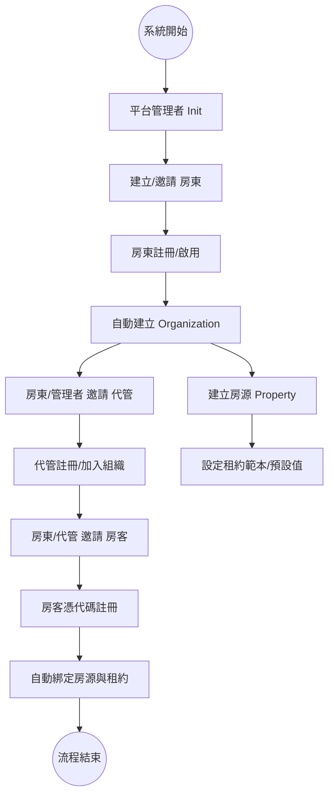
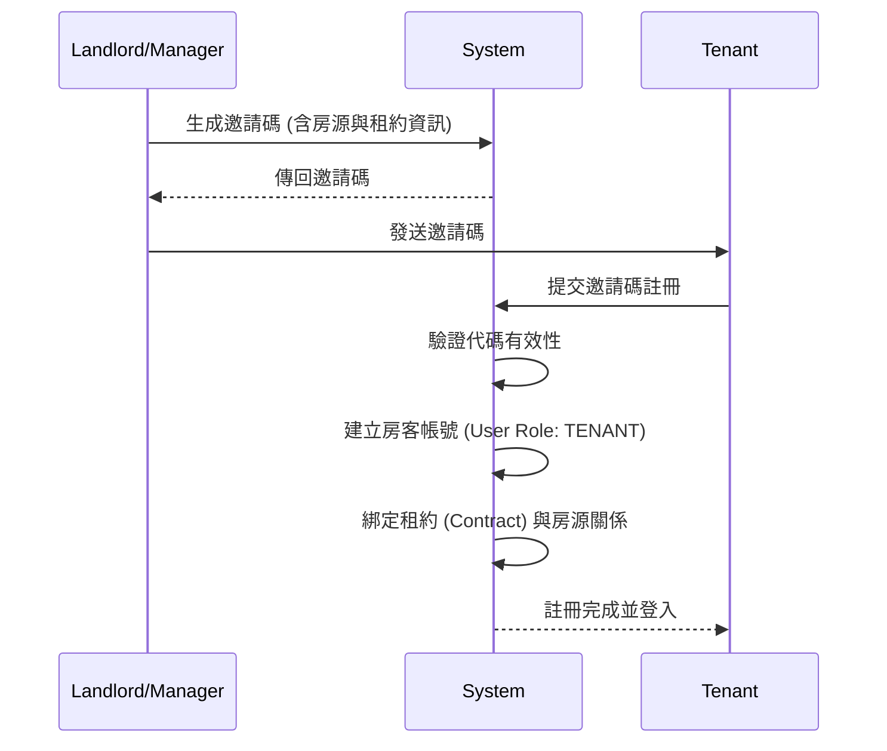
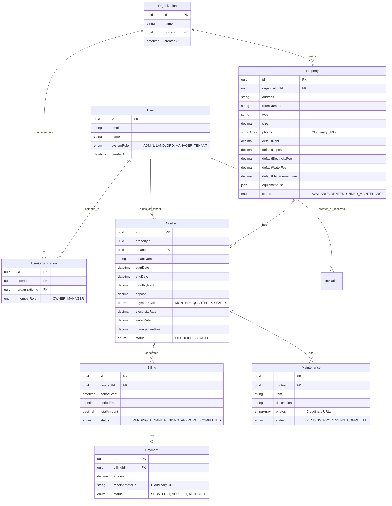
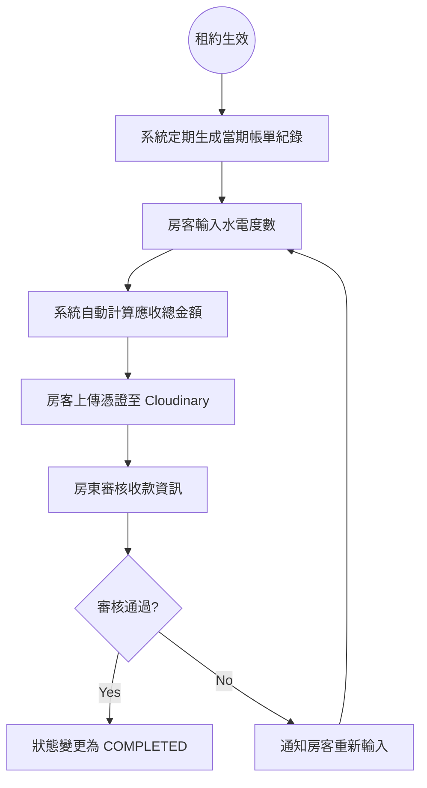
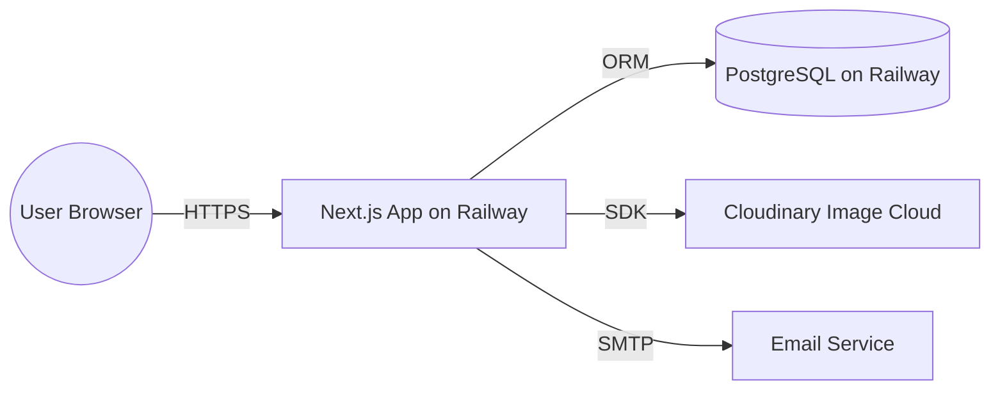

# 🏠 高端租屋代管平台系統規格文件 (spec.md)

## 1. 系統概述
本系統旨在提供高端租屋代管服務，支援多組織（Organization）架構，並針對四種角色（平台管理員、房東、代管人員、租客）提供嚴格的權限控管與自動化流程。

## 2. 技術棧
- **Frontend/Backend**: Next.js 14 (App Router)
- **Database ORM**: Prisma
- **Database**: PostgreSQL (Managed on Railway)
- **Storage**: Cloudinary (用於房源照片、修繕照片、匯款憑證)
- **Deployment**: Railway (容器化部署)
- **Auth**: NextAuth.js

## 3. 系統流程與圖表

### 3.1 角色註冊與加入流程圖 (Flowchart)

### 3.2 房客加入循序圖 (Sequence Diagram)

### 3.3 資料實體關聯圖 (ERD)

### 3.4 收款流程圖 (Flowchart)

### 3.5 部署架構圖 (UML Component Diagram)

## 4. 權限控管原則
- **platform_admin**: 全系統存取權，不屬於特定組織。
- **landlord**: 組織擁有者，可管理所屬組織、房源、代管人員、所有財務報表。
- **manager**: 組織成員，根據房東授權範圍管理房源、租約、帳單催收。
- **tenant**: 僅能查看關聯的租約、匯報度數、上傳繳費憑證、報修。

## 5. 外部整合規格
### 5.1 Cloudinary 儲存策略
- **資產分類**:
  - `properties/`: 房源照片
  - `payments/`: 匯款收據憑證 (需設定嚴格存取權)
  - `maintenance/`: 維修報修照片
- **安全性**: 繳費憑證需使用帶簽名的上傳 (Signed Uploads) 或私有存取 URL 確保隱私。

### 5.2 Railway 部署規劃
- **Environment Variables**:
  - `DATABASE_URL`: PostgreSQL 連線字串
  - `NEXTAUTH_SECRET`: 加密金鑰
  - `CLOUDINARY_URL`: Cloudinary 伺服器端 SDK 連線字串
  - `NEXT_PUBLIC_CLOUDINARY_CLOUD_NAME`: Cloudinary Cloud Name (前端上傳元件所需)
  - `NEXT_PUBLIC_CLOUDINARY_UPLOAD_PRESET`: Cloudinary 上傳預設值 (前端上傳元件所需)
  - `INVITATION_EXP_DAYS`: 邀請碼有效期設為環境變數 (預設 7 天)