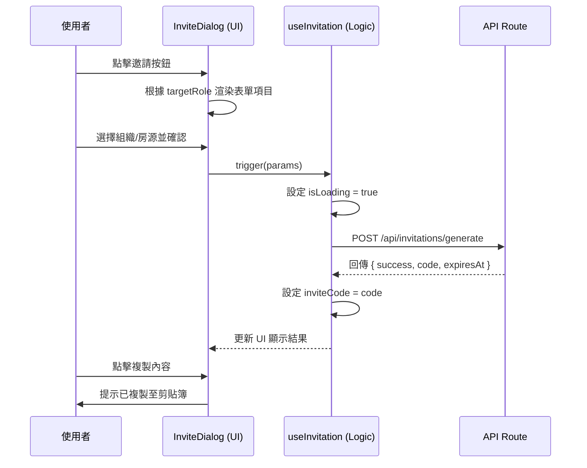

# 共通邀請功能組件規格文件 (Invitation System Spec)

## 1. 概述
為了解決目前管理員端 (Admin) 與房東端 (Landlord) 邀請功能代碼重複與 UI 不一致的問題，我們將建立一套共通的邀請機制。

### 核心目標
- **代碼複用**：將 API 請求、複製邏輯、狀態管理提取至公共層級。
- **UI 一致性**：統一導向對話框 (Dialog) 模式流程，提升使用者體驗。
- **維護性**：一致的驗證邏輯與過期處理。

---

## 2. 系統架構圖 (Component Structure)

```mermaid
graph TD
    subgraph "Admin Side"
        A[Admin Settings Page] -->|Trigger| B[Shared InviteDialog]
    end

    subgraph "Landlord Side"
        L[Member Management Page] -->|Trigger| B
        P[Property Detail Page] -->|Trigger| B
    end

    subgraph "Shared Component Library"
        B --> C[useInvitation Hook]
        B --> D[RoleSelector]
        B --> E[ContextSelector]
        B --> F[InviteResultView]
    end

    C -->|API Request| G[/api/invitations/generate]
```

---

## 3. 業務流程圖 (Business Flow)


---

## 4. 順序圖 (Sequence Diagram)



---

## 5. 營收趨勢與最近動態實作規格 (Dashboard Extensions Spec)

### 5.1 營收趨勢圖 (Revenue Trend)
- **API 路由**: `GET /api/landlord/stats/revenue`
- **邏輯**:
  - 獲取目前組織最近 6 個月的 `Billing` 數據。
  - 僅計算 `status: "COMPLETED"` 且 `totalAmount` 不為空的帳單。
  - 按月分組，回傳格式為 `[{ month: string, amount: number }]`。
- **組件**: 修改現有的 `src/components/dashboard/RevenueChart.tsx` 支援動態數據載入。
  - **渲染優化**: 使用 `isMounted` 狀態確保圖表僅在客戶端掛載後渲染，避免 `ResponsiveContainer` 在 SSR 階段因無法取得寬高而產生 `-1` 警告。

### 5.2 最近動態 (Recent Activities)
- **API 路由**: `GET /api/landlord/audit-logs`
- **邏輯**:
  - 獲取目前組織最近 10 筆 `AuditLog`。
  - 包含 `user` (執行者) 與相關動態資訊。
- **前端實作**: 在 `src/app/landlord/page.tsx` 進行伺服器端請求，並渲染至「最近動態」區塊。

---

## Tasks
1. [x] 建立 `src/hooks/use-invitation.ts` 处理逻辑
2. [x] 建立 `src/components/invitations/InviteResultView.tsx` 顯示結果
3. [x] 修改 `src/app/landlord/members/InviteMemberDialog.tsx`
4. [x] 在 `src/app/admin/settings/` 建立觸發按鈕，取代舊有的長表單
5. [ ] 建立 `GET /api/landlord/stats/revenue` API 獲取營收統計數據
6. [ ] 修改 `RevenueChart.tsx` 以串接真實數據
7. [ ] 修改 `src/app/landlord/page.tsx` 串接「最近動態」真實數據