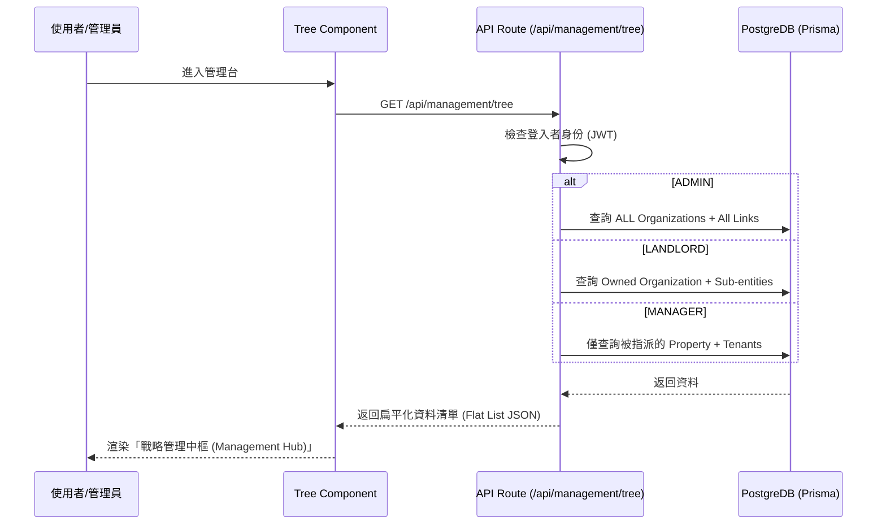
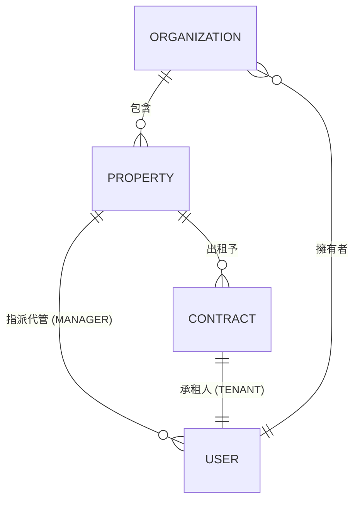

# 📋 整合式組織與用戶管理 (Integrated Org & User Management Tree) 規格文件

## 1. 系統概述
旨在提供一個直觀、高端且具備層級感的操作界面，將「組織、房東、房賃、代管人員、房客」五個維度整合於單一樹狀視圖中。系統會根據登入者的角色，動態過濾其可見的資料範圍。

## 2. 業務邏輯與資料權限 (Data Visibility Matrix)

| 角色 (Role) | 可見根節點 | 層級深度 | 權限範圍 |
| :--- | :--- | :--- | :--- |
| **ADMIN** | 所有 Organizations | 全展開 | 全系統維護、停權/恢復用戶。 |
| **LANDLORD** | 所屬 Organization | 全展開 | 組織內資產與人員管理、指派 Manager。 |
| **MANAGER** | 所屬 Organization | 僅顯示負責房源 & 房客 | 日常維運、查看所屬房客帳單/報修。 |
| **TENANT** | (不採用樹狀管理) | N/A | 僅查看個人合約與帳單。 |

## 3. UI/UX 設計理念 (角色化一站式扁平管理)

### 3.1 PC 端 (Desktop Layout) - 主從式扁平索引介面
- **左側身分清單 (Role-based Flat Index)**:
    - 取消遞迴樹狀顯示，改為根據角色顯示對應的「核心管理清單」。
    - **管理者 (Admin)**: 顯示全系統「房東列表」。
    - **代管 (Manager)**: 顯示「授權房東列表」。
    - **房東 (Landlord)**: 顯示「房源列表」。
- **右側工作區內容 (Dynamic Workspace)**:
    - 採用 **Tabs (頁籤)** 進行內容導航。
    - **[組織中心]**: 顯示該組織的基本資料與資產現狀。
    - **[用戶清單]**: 整合「房東、經理、房客」於單一列表，並透過角色標籤區分。
- **狀態標籤 (Status Indicators)**:
    - 🏢 組織：深金屬色調，顯示組織名稱。
    - 👤 房東：藍色標章。
    - 🏠 房源：
        - 🟢 綠色：出租中。
        - 🔵 藍色：閒置中。
        - 🔴 紅色：維修中或有緊急報修。
    - 🛠️ 代管：顯示所管轄房源數量。
    - 🔑 房客：顯示合約到期倒數。
- **停權狀態**: 若用戶狀態為 `SUSPENDED`，節點名稱顯示刪除線並以灰色半透明呈現。

### 3.2 手機端 (Mobile/Responsive) - 觸控鑽取
- **鑽取導航 (Drill-down Navigation)**: 點擊節點後滑入下一層級。
- **響應式抽屜 (Bottom Drawer)**: 點擊節點從底部彈出詳細資訊與操作功能（如：催款、報修處理）。

## 4. 技術架構 (UML)

### 4.1 資料層級與過濾邏輯 (Sequence Diagram)

### 4.2 物件關聯圖 (ERD - 管理樹架構)

## 5. UI 元件清單
- `ManagementSidebar`: 管理樹的左側容器。
- `CustomNodeRenderer`: 渲染不同類型節點的 icon 與文字細節。
- `NodeActionToolbar`: 節點右鍵選單或 Hover 顯示的操作列。
- `EntityDetailPanel`: 右側或手機底部的抽屜式詳情頁。