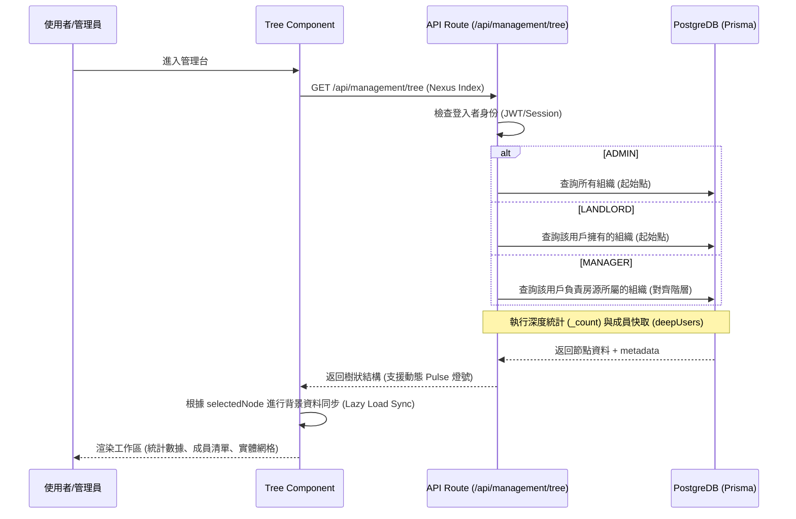
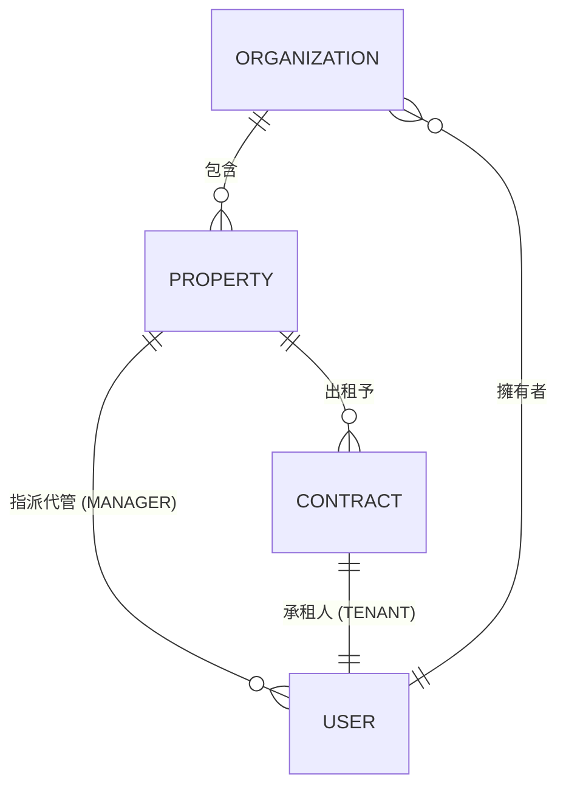
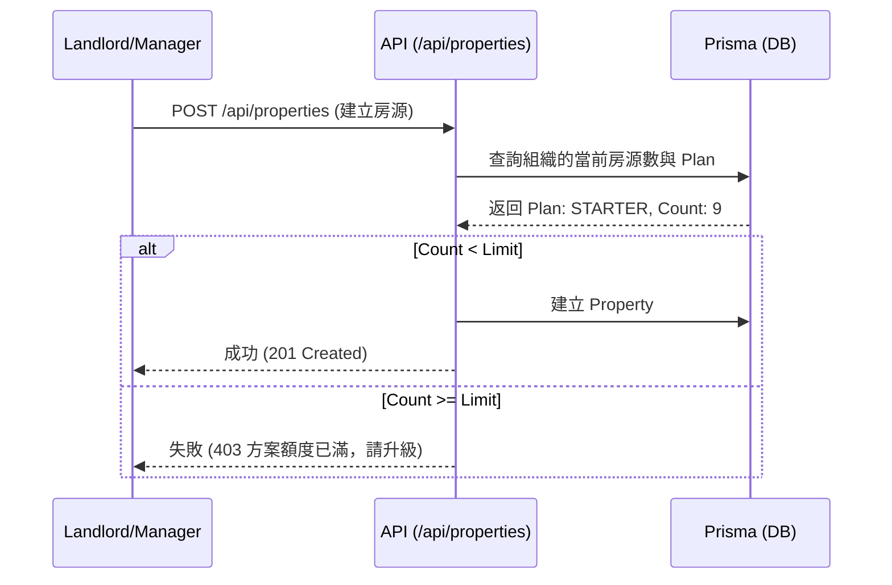

# 📋 整合式組織與用戶管理 (Integrated Org & User Management Tree) 與 SaaS 收費規格

## 1. 系統概述
旨在提供一個直觀、高端且具備層級感的操作界面，將「組織、房東、房源、管理人員、房客」整合於單一樹狀視圖中。系統採用「Nexus Index」架構，確保各管理層級之權責與導航邏輯一致。

## 2. 角色權限與設計導向 (Roles & Design Orientation)
本系統的角色定義、權限矩陣、註冊流程、停權政策以及 **Nexus Index 導航架構**，請統一參閱 [🏠 角色權限與加入流程規格 (`docs/roles.md`)](docs/roles.md)。

## 3. UI/UX 設計理念 (角色化一站式扁平管理)

### 3.1 PC 端 (Desktop Layout) - Nexus Pulse 導航終端
詳見 [`docs/admin_v2_design_spec.md`](docs/admin_v2_design_spec.md)。
- **設計目標**: 費用與營收監控、生態健康診斷 (出租率/訪客流量)、零滾動 (Zero-Scroll)。
- **行動面板切換 (Action Vault Toggle)**:
    - 提供「桌面版」右側面板切換按鈕，允許管理員在需要專門分析數據時暫時隱藏右側面板，擴大主工作區寬度。
    - 切換按鈕位於頂部工具欄右側。
- **四大監控維度**: 成本總額 (DB/Media)、收益總額 (MRR)、出租效能 (Occupancy)、獲客流量 (Visitor Traffic)。
- **視覺風格**: 明亮專業戰略面板 (Bright Professional)，配合房東端 UI 配色 (Slate/White)，採用嵌入式微型圖表 (Sparklines) 提升資訊密度。
- **治理模型**: 具備全平台成員一鍵停權與強制訂閱重置權限。
- **Nexus Pulse 偵測系統**:
    - **動態脈動點 (Pulse Indicator)**: 節點左側具備動態漸變光環，即時反應實體稼動狀態。
    - **Entity DNA**: 工作區整合微型診斷圖表，監控資源分配與延遲。
    - **Lineage Breadcrumbs**: 頂部導航顯示「組織 > 房東 > 房源」之血緣路徑。
- **狀態標籤 (Status Indicators)**:
    - 🏢 組織：深金屬色調，顯示組織名稱。
    - 👤 房東：藍色標章。
    - 🏠 房源：
        - 🟢 綠色：出租中。
        - 🔵 藍色：閒置中。
        - 🔴 紅色：維修中或有緊急報修。
    - 🛠️ 代管：顯示所管轄房源數量。
    - 🔑 房客：顯示合約到期倒數。
- **治理決策輔助 (Governance Safety)**:
    - **影響評估告知**: 當在 Command Vault 執行停權時，需根據 [`docs/roles.md`](docs/roles.md:75) 顯示預期的層級影響。
        - *Landlord 停權*: 提示「此行為將隱藏所有旗下房源，並凍結組織下 Manager 之編輯權限」。
        - *Manager 停權*: 提示「需重新指派受影響房源之管理權」。
- **停權狀態視覺**: 若用戶狀態為 `SUSPENDED`，樹狀圖節點名稱顯示刪除線並以灰色半透明呈現，節點脈動燈號變為灰色熄滅狀態。

### 3.2 手機端 (Mobile/Responsive) - 觸控鑽取
- **鑽取導航 (Drill-down Navigation)**: 點擊節點後滑入下一層級。
- **響應式抽屜 (Bottom Drawer)**: 點擊節點從底部彈出詳細資訊與操作功能（如：催款、報修處理）。

## 4. 技術架構 (UML)

### 4.1 資料層級與過濾邏輯 (Sequence Diagram)

### 4.2 物件關聯圖 (ERD - 管理樹架構)

### 4.3 管理層級與 UI 對應邏輯 (UI Hierarchy Mapping)
詳細映射規則、各層級成員顯示過濾條件以及 UI 識別規範，請參閱 [角色權限規格 (docs/roles.md#6-nexus-index-導航架構與工作區映射)](docs/roles.md#6-nexus-index-導航架構與工作區映射)。

## 5. UI 元件清單 (整合版)
- `ManagementViewWrapper`: 治理中心主容器，包含情境感知之 Action Vault。
- `ManagementTree`: 遞迴層級索引，反應實體脈動狀態。
- `CommandVault`: 右側動態管理面板，整合 `OrgPlanManager` 與 `UserStatusToggle`。
- `GovernanceImpactAdvisor`: 位於 Command Vault 內的風險顯示組件。

---

## 6. 收費策略與方案限制 (SaaS Billing & Limits)

### 6.1 訂閱方案概覽

| 方案名稱 | 月費 (TWD) | 房源上限 | 適用對象 |
| :--- | :--- | :--- | :--- |
| **Free** | $0 | 2 間 | 測試用房東、體驗用戶。 |
| **Starter** | $299 | 10 間 | 小型房東、獨立代管人員。 |
| **Pro** | $999 | 50 間 | 專業代管公司、多房產房東。 |

### 6.2 方案檢查流程 (Property Creation Guard)

### 6.3 角色變更與邀請邏輯 (Genesis Entry)
詳細加入流程與邀請機制請參閱 [`docs/roles.md`](docs/roles.md#3-註冊與加入流程)。

- **Genesis Portal (官方邀請)**: 僅 Admin 可發起，支援預指派訂閱方案與多組織管理專家職能。
- **Admin 限制**: 專注於全域診斷與系統參數指揮 (AIC v3)，不參與具體租賃業務。

### 6.4 戰略參數控制 (Control Room Room - /admin/settings)
- **Feature Flags**: 統籌 AI 租金建議、電子簽章、區塊鏈憑證等高效能模組的全局啟動。
- **Threshold Policy**: 管理員可於介面微調「出租率警告線 (40%)」、「度電預設費率」與「Prisma 資料庫警戒容量」等關鍵數值。
- **Infrastructure Pulse**: 視覺化監控系統基礎負載（Conn Pool, API RPM, Server Load Bitrate），確保治理決策具備數據支撐。
- **組織擁有權**: 訂閱方案與 `Organization` 綁定。原 Landlord 可將組織轉移給其他用戶，訂閱狀態隨之轉移。

## 5. 治理模組定義 (整合版)
- `/admin/management`: **AIC 統合治理中心 (Nexus Pulse)**。
    - **核心機制**：採用「一站式治理解析終端」設計，整合組織與用戶管理。
    - **左側導航**：Management Tree (血緣索引)，支援動態狀態脈動點。
    - **右側面板 (Command Vault)**：情境感知面板，根據選中節點切換管理工具（方案管理、用戶停權、資產診斷）。
- `/admin/organizations`: (過渡期) 組織實體手速台。未來功能併入 Nexus Pulse。
- `/admin/users`: (過渡期) 身份治理。未來功能併入 Nexus Pulse。