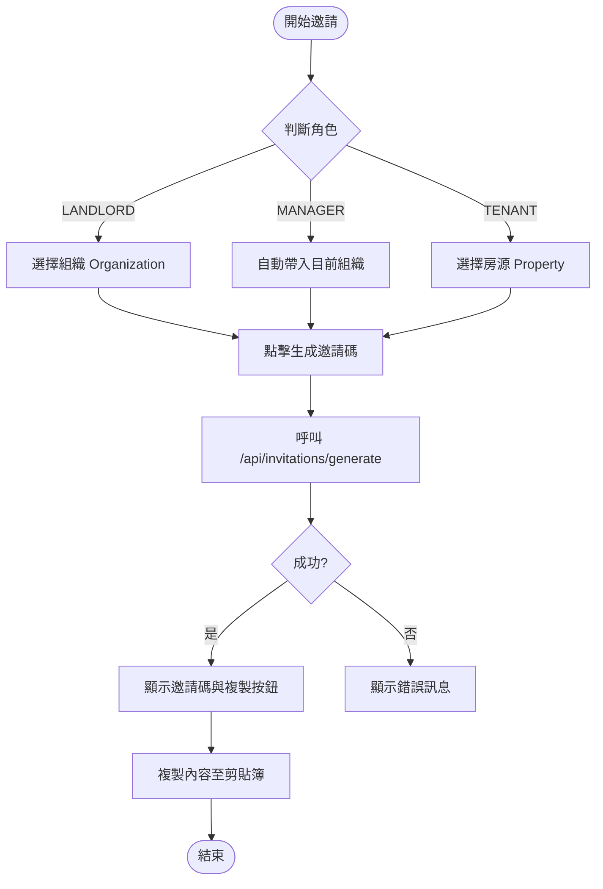
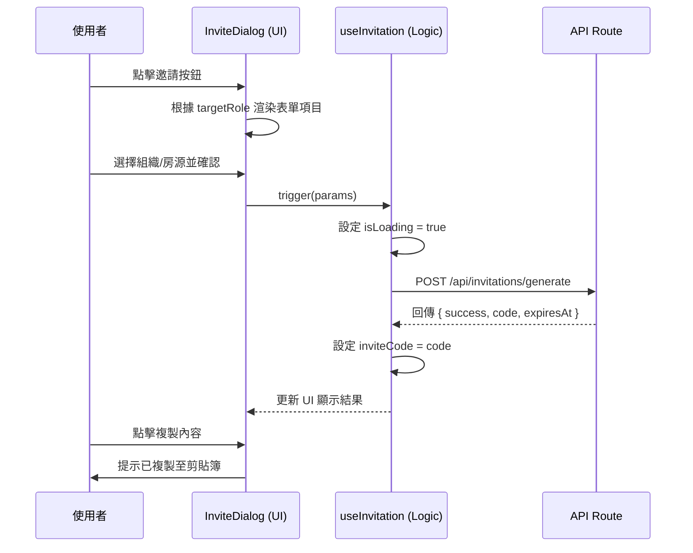

# 共通邀請功能組件規格文件 (Invitation System Spec)

## 1. 概述
為了解決目前管理員端 (Admin) 與房東端 (Landlord) 邀請功能代碼重複與 UI 不一致的問題，我們將建立一套共通的邀請機制。

### 核心目標
- **代碼複用**：將 API 請求、複製邏輯、狀態管理提取至公共層級。
- **UI 一致性**：統一導向對話框 (Dialog) 模式流程，提升使用者體驗。
- **維護性**：一致的驗證邏輯與過期處理。

---

## 2. 系統架構圖 (Component Structure)

```mermaid
graph TD
    subgraph "Admin Side"
        A[Admin Settings Page] -->|Trigger| B[Shared InviteDialog]
    end

    subgraph "Landlord Side"
        L[Member Management Page] -->|Trigger| B
        P[Property Detail Page] -->|Trigger| B
    end

    subgraph "Shared Component Library"
        B --> C[useInvitation Hook]
        B --> D[RoleSelector]
        B --> E[ContextSelector]
        B --> F[InviteResultView]
    end

    C -->|API Request| G[/api/invitations/generate]
```

---

## 3. 業務流程圖 (Business Flow)



---

## 4. 順序圖 (Sequence Diagram)



---

## 5. 組件介面設計 (Component Interface)

### 5.1 `useInvitation` Hook
負責封裝所有非同步邏輯。
- **Input**: `onSuccess?`, `onError?`
- **Output**:
  - `generate(data: { organizationId, targetRole, propertyId? })`
  - `inviteCode`: `string | null`
  - `isLoading`: `boolean`
  - `isCopied`: `boolean`
  - `copyContent()`: `Function (複製格式化的邀請文字)`

### 5.2 `InviteDialog` (Main Container)
- **Props**:
  - `targetRole`: `LANDLORD | MANAGER | TENANT`
  - `organizationId?`: (可選) 房東端固定傳入，管理員端可由下拉選單決定
  - `onSuccess?`: 生成成功後的報表更新回調

---

## Tasks
1. [x] 建立 `src/hooks/use-invitation.ts` 处理逻辑
2. [x] 建立 `src/components/invitations/InviteResultView.tsx` 顯示結果
3. [x] 修改 `src/app/landlord/members/InviteMemberDialog.tsx`
4. [x] 在 `src/app/admin/settings/` 建立觸發按鈕，取代舊有的長表單