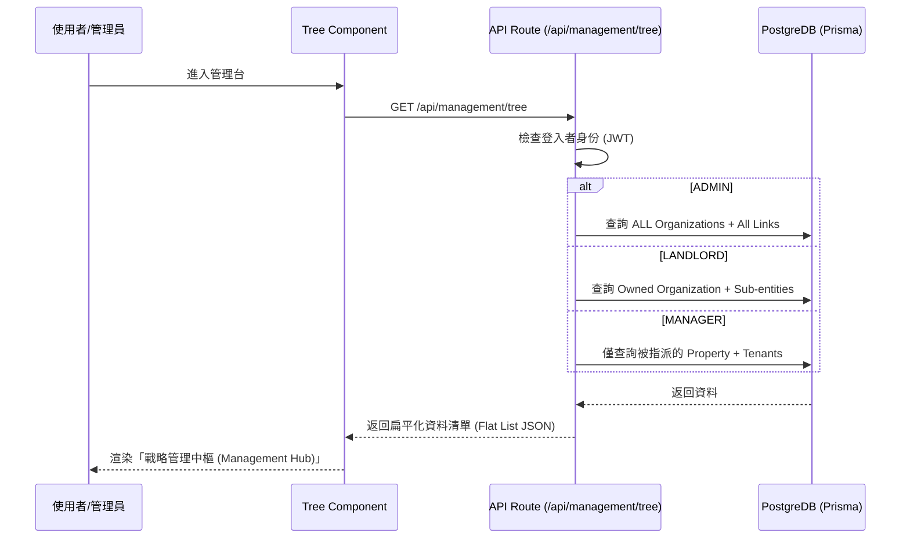
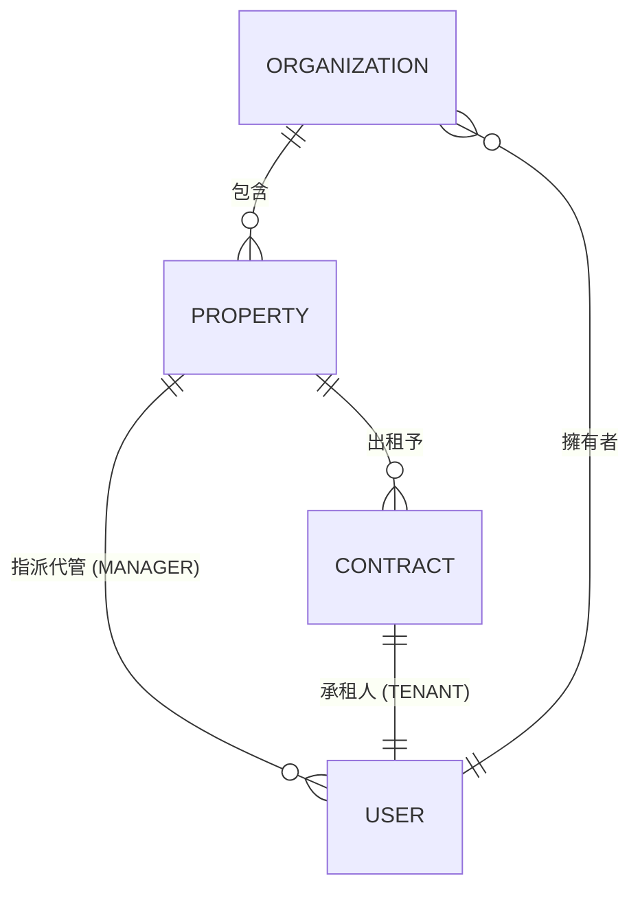
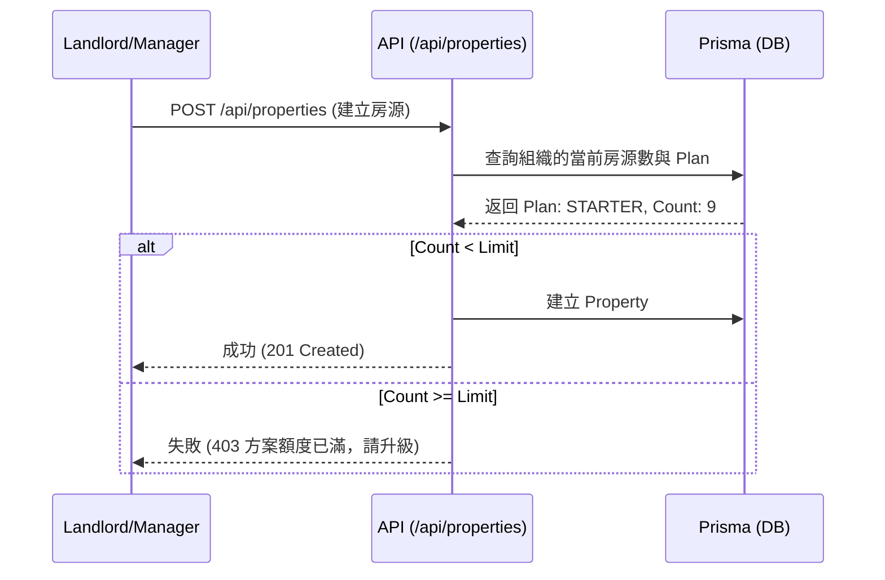

# 📋 整合式組織與用戶管理 (Integrated Org & User Management Tree) 與 SaaS 收費規格

## 1. 系統概述
旨在提供一個直觀、高端且具備層級感的操作界面，將「組織、房東、房賃、代管人員、房客」五個維度整合於單一樹狀視圖中。系統會根據登入者的角色，動態過濾其可見的資料範圍。

## 2. 業務邏輯與資料權限 (Data Visibility Matrix)

| 角色 (Role) | 可見根節點 | 層級深度 | 權限範圍 |
| :--- | :--- | :--- | :--- |
| **ADMIN** | 所有 Organizations | 全展開 | SaaS 營運監控、邀請與資源管理、全平台成員治理 (全域停權)、強制調整訂閱方案 (已實作)。 |
| **LANDLORD** | 所屬 Organization | 全展開 | 組織內資產與人員管理、指派 Manager。 |
| **MANAGER** | 所屬 Organization | 僅顯示負責房源 & 房客 | 日常維運、查看所屬房客帳單/報修。 |
| **TENANT** | (不採用樹狀管理) | N/A | 僅查看個人合約與帳單。 |

## 3. UI/UX 設計理念 (角色化一站式扁平管理)

### 3.1 PC 端 (Desktop Layout) - Nexus Pulse 導航終端
詳見 [`docs/admin_v2_design_spec.md`](docs/admin_v2_design_spec.md)。
- **設計目標**: 費用與營收監控、生態健康診斷 (出租率/訪客流量)、零滾動 (Zero-Scroll)。
- **四大監控維度**: 成本總額 (DB/Media)、收益總額 (MRR)、出租效能 (Occupancy)、獲客流量 (Visitor Traffic)。
- **視覺風格**: 明亮專業戰略面板 (Bright Professional)，配合房東端 UI 配色 (Slate/White)，採用嵌入式微型圖表 (Sparklines) 提升資訊密度。
- **治理模型**: 具備全平台成員一鍵停權與強制訂閱重置權限。
- **Nexus Pulse 偵測系統**:
    - **動態脈動點 (Pulse Indicator)**: 節點左側具備動態漸變光環，即時反應實體稼動狀態。
    - **Entity DNA**: 工作區整合微型診斷圖表，監控資源分配與延遲。
    - **Lineage Breadcrumbs**: 頂部導航顯示「組織 > 房東 > 房源」之血緣路徑。
- **狀態標籤 (Status Indicators)**:
    - 🏢 組織：深金屬色調，顯示組織名稱。
    - 👤 房東：藍色標章。
    - 🏠 房源：
        - 🟢 綠色：出租中。
        - 🔵 藍色：閒置中。
        - 🔴 紅色：維修中或有緊急報修。
    - 🛠️ 代管：顯示所管轄房源數量。
    - 🔑 房客：顯示合約到期倒數。
- **停權狀態**: 若用戶狀態為 `SUSPENDED`，節點名稱顯示刪除線並以灰色半透明呈現。

### 3.2 手機端 (Mobile/Responsive) - 觸控鑽取
- **鑽取導航 (Drill-down Navigation)**: 點擊節點後滑入下一層級。
- **響應式抽屜 (Bottom Drawer)**: 點擊節點從底部彈出詳細資訊與操作功能（如：催款、報修處理）。

## 4. 技術架構 (UML)

### 4.1 資料層級與過濾邏輯 (Sequence Diagram)

### 4.2 物件關聯圖 (ERD - 管理樹架構)

## 5. UI 元件清單
- `ManagementSidebar`: 管理樹的左側容器。
- `CustomNodeRenderer`: 渲染不同類型節點的 icon 與文字細節。
- `NodeActionToolbar`: 節點右鍵選單或 Hover 顯示的操作列。
- `EntityDetailPanel`: 右側或手機底部的抽屜式詳情頁。

---

## 6. 收費策略與方案限制 (SaaS Billing & Limits)

### 6.1 訂閱方案概覽

| 方案名稱 | 月費 (TWD) | 房源上限 | 適用對象 |
| :--- | :--- | :--- | :--- |
| **Free** | $0 | 2 間 | 測試用房東、體驗用戶。 |
| **Starter** | $299 | 10 間 | 小型房東、獨立代管人員。 |
| **Pro** | $999 | 50 間 | 專業代管公司、多房產房東。 |

### 6.2 方案檢查流程 (Property Creation Guard)

### 6.3 角色變更與邀請邏輯 (Genesis Entry)
- **Genesis Portal (官方邀請)**:
    - 僅 Admin 可在發送邀請時，指定用戶為 Landlord 或 Manager 並預期指派訂閱方案權限。
    - 支援「官方招募」機制，發起不具初始組織繫結的專家級邀請（由註冊者自行定義組織）。
- **Admin 限制**: 不參與任何具體租賃事務，專注於全域診斷與系統參數指揮 (AIC v3)。

### 6.4 戰略參數控制 (Control Room Room - /admin/settings)
- **Feature Flags**: 統籌 AI 租金建議、電子簽章、區塊鏈憑證等高效能模組的全局啟動。
- **Threshold Policy**: 管理員可於介面微調「出租率警告線 (40%)」、「度電預設費率」與「Prisma 資料庫警戒容量」等關鍵數值。
- **Infrastructure Pulse**: 視覺化監控系統基礎負載（Conn Pool, API RPM, Server Load Bitrate），確保治理決策具備數據支撐。
- **組織擁有權**: 訂閱方案與 `Organization` 綁定。原 Landlord 可將組織轉移給其他用戶，訂閱狀態隨之轉移。